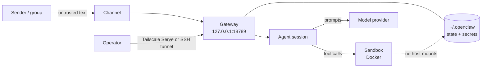

# Architecture

## Components

- **Gateway** — the local control plane. Owns sessions, tools, events, and
  channel connections. Binds to `127.0.0.1:18789` and stays on the host.
- **Control UI / CLI / TUI** — clients that talk to the Gateway.
- **Channels** — messaging integrations (Telegram, Discord, Slack, WhatsApp,
  Signal, and others). Untrusted input arrives here.
- **Model provider** — hosted or local. Prompts leave the machine when the
  provider is remote.
- **Sandbox backend** — where tool execution runs. Docker on the host, or SSH to
  a sibling. The Gateway does not run inside it.
- **State** — `~/.openclaw`, including `openclaw.json`, credentials, memory, and
  sessions.

## Trust boundaries

1. **Chat input is untrusted.** Any message may be prompt injection.
2. **The model is untrusted.** Its tool calls are proposals, gated by policy.
3. **The host is the trust anchor.** The Gateway and its state live here.
4. **The sandbox is a blast-radius limit, not a wall.** The project's own docs
   call it "not a perfect security boundary". Separate machines or OS users are
   the real boundary between different trust levels.
5. **WSL2 sits between the distro and Windows.** A loopback bind inside the
   distro is reachable from Windows through localhost forwarding; this is
   expected and safe. Binding a wildcard address is not.

## Data flow for one message

1. A sender messages the bot on a channel.
2. The Gateway routes it to an agent session, scoped per peer.
3. The agent calls the model provider.
4. The model returns tool calls. Policy is applied before anything runs: the
   tool must be allowed, and exec must pass the approval gate.
5. Allowed execution happens in the sandbox.
6. The result returns to the agent, then to the channel.

## Where configuration applies

- `gateway.bind` and `gateway.auth` — boundary 1 and the operator path.
- `session.dmScope` — session isolation at boundary 1.
- `agents.defaults.sandbox.*` — boundary 4.
- `tools.profile`, `tools.exec`, `tools.elevated` — boundary 2, the gate between
  the model and the host.

## Deployment shapes

- **Now:** Gateway in WSL2 on this machine, Docker sandbox on the same host,
  Tailscale on the Windows host.
- **Homelab:** the same layout on the Windows 10 server, reached over the
  tailnet.
- **Later:** sandbox execution can move to a separate host with the SSH backend
  without changing the Gateway configuration.
